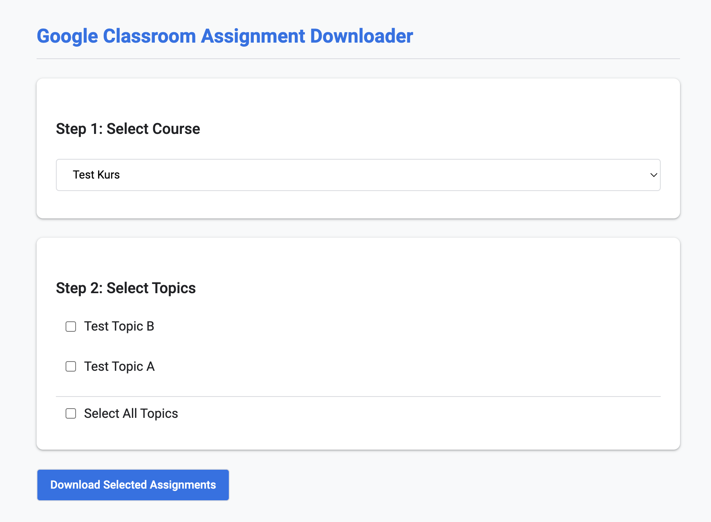
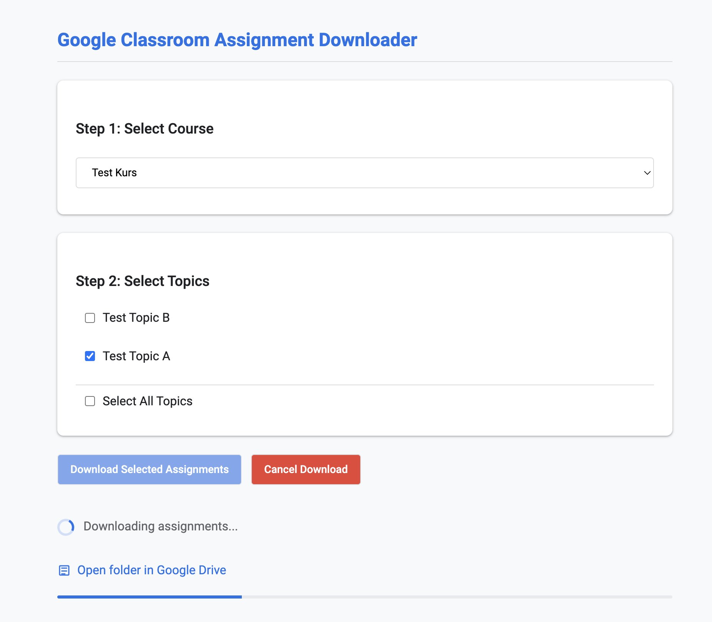

# Google Classroom Assignment Downloader

A simple Google Apps Script tool that downloads student assignments from Google Classroom, organizes them by topic and student, and renames files according to a consistent format.

## Features

- **Topic-based organization**: Download assignments from specific topics or all topics
- **Student folders**: Creates one folder per student within each topic
- **Consistent naming**: Files are renamed to `assignment-title_student-name.extension`
- **PDF conversion**: Option to automatically convert compatible files (Google Docs, Sheets, Slides, and Microsoft Office files) to PDF format

Note: PDF conversion only works for Google Workspace files and Microsoft Office formats. Other file types (images, audio, etc.) will remain in their original format.

## Screenshots




## Installation


### Deployment Instructions

1. Go to [Google Apps Script](https://script.google.com/) and create a new project
2. Copy the code from `code.gs` in this repository and paste it into your project
3. Click on "Services" (+ icon) and add these Google services:
   - Google Classroom API
   - Google Drive API
4. Save the project (Ctrl+S or ⌘+S)
5. Deploy as a web app:
   - Click "Deploy" > "New deployment"
   - Select "Web app" as the deployment type
   - Set "Execute as" to "User accessing the web app"
   - Set "Who has access" to "Anyone in your organization"
   - Click "Deploy"
   - Authorize the app when prompted
   - Copy the provided URL to access your app


## Required Permissions

When you first run the app, it will request the following permissions:

- **Google Classroom**: To access courses, topics, assignments, and student submissions
- **Google Drive**: To create folders and save downloaded files

These permissions are necessary for the app to function. The app runs under your account, so it only has access to the courses where you are a teacher or owner.

## Required Google APIs

This script uses the following Google APIs:

- **Google Classroom API**: For accessing classroom data
- **Google Drive API**: For file operations

These are automatically enabled when you add the services in the Apps Script editor.

## Usage

1. Open the web app URL
2. Select a course from the dropdown
3. Choose which topics to download (or select all)
4. Optional: Check "Convert compatible files to PDF" to convert documents to PDF format
5. Click "Download Selected Assignments"
6. A Google Drive folder will be created with the downloaded files
7. Click the provided link to open the folder

## Folder Structure

The app creates the following folder structure in your Google Drive:

```
Classroom Downloads - [Course Name]/
├── Topic 1/
│   ├── Student A/
│   │   └── assignment-name_student-a.ext
│   └── Student B/
│       └── assignment-name_student-b.ext
├── Topic 2/
│   └── ...
└── Uncategorized/
    └── ...
```