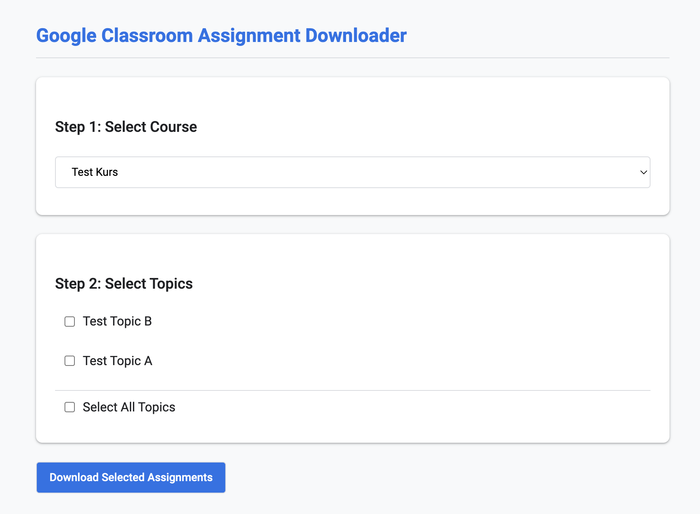
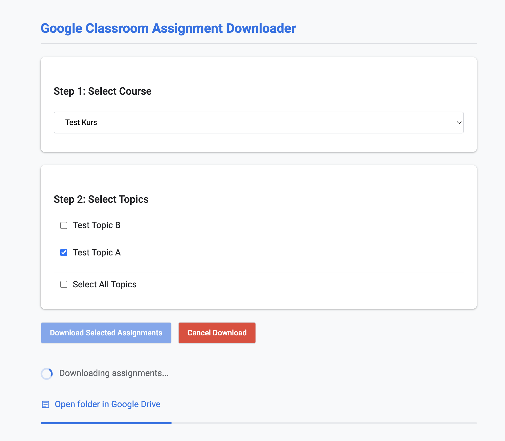

# Google Classroom Assignment Downloader

A simple Google Apps Script tool that downloads student assignments from Google Classroom, organizes them by topic and student, and renames files according to a consistent format.

## Features

- **Topic-based organization**: Download assignments from specific topics or all topics
- **Student folders**: Creates one folder per student within each topic
- **Consistent naming**: Downloaded files use Unicode-safe names with stable assignment IDs and attachment indices
- **PDF conversion**: Option to convert Google Docs, Sheets, and Slides to PDF

Microsoft Office files and other binary formats remain in their original format. A failed Google Workspace conversion also falls back to the original file.

## Screenshots




## Installation


### Deployment Instructions

1. Go to [Google Apps Script](https://script.google.com/) and create a new project
2. Copy the code from `code.gs` in this repository and paste it into your project
3. Click on "Services" (+ icon) and add the Google Classroom API
4. Save the project (Ctrl+S or ⌘+S)
5. Deploy as a web app:
   - Click "Deploy" > "New deployment"
   - Select "Web app" as the deployment type
   - Set "Execute as" to "User accessing the web app"
   - Set "Who has access" to "Anyone in your organization"
   - Click "Deploy"
   - Authorize the app when prompted
   - Copy the provided URL to access your app


## Required Permissions

When you first run the app, it will request the following permissions:

- **Google Classroom**: To access courses, topics, assignments, and student submissions
- **Google Drive**: To create folders and save downloaded files

These permissions are necessary for the app to function. The app runs under your account, so it only has access to the courses where you are a teacher or owner.

## Required Google API

This script uses the following advanced Google API:

- **Google Classroom API**: For accessing classroom data

Drive file operations use Apps Script's built-in Drive service and do not require adding the advanced Drive API.

## Usage

1. Open the web app URL
2. Select a course from the dropdown
3. Choose which topics to download (or select all)
4. Optional: Check "Convert compatible files to PDF" to convert Google Docs, Sheets, and Slides
5. Click "Download Selected Assignments"
6. A Google Drive folder will be created with the downloaded files
7. Click the provided link to open the folder

## Folder Structure

The app creates the following folder structure in your Google Drive:

```
Classroom Downloads - [Course Name]/
├── Topic 1/
│   ├── Student A/
│   │   ├── assignment-name_student-a_assignment-id_1.ext
│   │   └── assignment-name_student-a_assignment-id_2_link.txt
│   └── Student B/
│       └── assignment-name_student-b_assignment-id.ext
├── Topic 2/
│   └── ...
└── Uncategorized/
    └── ...
```

An attachment index is added when a submission contains multiple attachments. Link stubs also include a `_link` marker. Assignment IDs remain in names to prevent collisions between assignments with identical or similarly sanitized titles.

## Student report attachment fields

Drive-file entries in `summary.json` use these naming fields consistently:

- `name` and `originalName`: the source file name in Classroom/Drive
- `outputName`: the generated on-disk name, or `null` when the file was skipped or could not be copied

Link entries retain their separate `type`, `url`, and `title` fields.

## Naming compatibility note

Unicode-safe naming adds assignment IDs, conditional attachment indices, and link markers. Exports created beside folders from older versions can therefore use different folder or file names; this does not modify existing exports.
